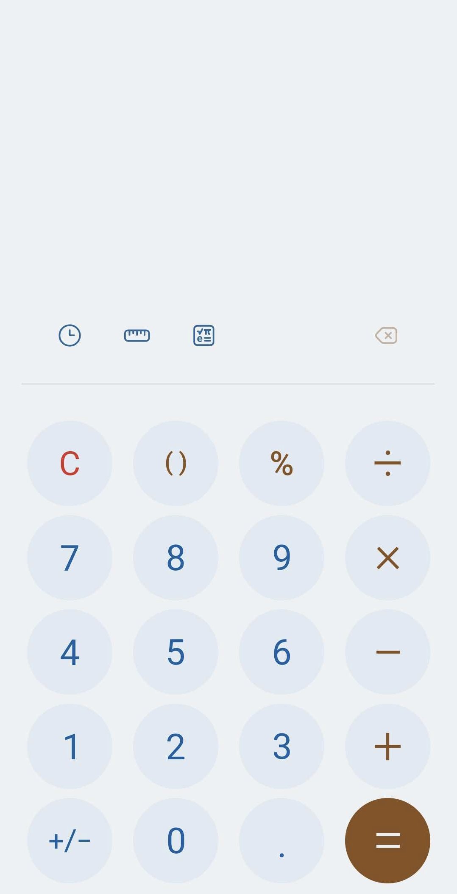

# STARTERS 취업부트캠프 중간평가 (Android)

### 평가 안내

---

- 핸드폰에 기본적으로 설치되어있는 앱 중 하나인 계산기 앱을 구현합니다.
- 평가일정
    - 시험 시작 ~ 오후 6시 (점심시간인 오후 12시 30분 ~ 2시에는 반드시 퇴실)
- 평가방법
    - 평가배점표에 따라 기본점수에서 가감하여 총합된 점수로 평가
- 제출방법
    - 제출은 Github Repository로 제출 시간 내 Pull Request를 진행합니다.
    - [구글폼](https://forms.gle/8D7pQyk8A3ViHA6A8)을 통해 파일 및 Github 아이디를 제출합니다.
        - AAB(혹은 APK) 파일은 압축 후 제출합니다.
- 추가과제로 진행하는 코드리뷰의 경우 평가 종료 후 별도 안내 예정

### 평가 전 주의사항

---

- 스택 별로 권장되는 코딩 표준 스타일을 활용합니다.
    - [Kotlin 코딩 표준](https://www.notion.so/Kotlin-770ade858b7940b5aec1905ad9406938)
- 인터넷 상에서 구현에 필요한 사항을 검색/활용할 수 있습니다.
- 기타 부정행위로 간주될만한 사항이 적발될 경우 강제퇴실 처리

### 평가배점

---

| 구분 | 내용 |
| --- | --- |
| 기본점수 | 200점 |
| 코딩 표준 스타일 | 미준수 시 건당 -1점 |
| 기능 요구사항 | 구현 시 +20점, 미구현 시 -10점
선택문항 구현시 +30점, 미구현 시 점수 차감 없음 |
| 예외처리 고려사항 | 구현 시 +20점, 미구현 시 -20점 |
| UI 요구사항 | 구현 시 +20점, 미구현 시 -20점 |

### 전제사항

---

- 에러 없이 계산기의 온전한 기능을 하게끔 구현합니다.
- UI는 자신의 스마트폰에 계산기 앱을 따라 최대한 구현합니다.
    - 고객에게 서비스의 기능에 대한 시각적 단서를 제공하는 것을 우선으로 합니다.
- 계산 히스토리, 단위 계산기, 공학용 계산기는 구현하지 않습니다.

### 기능 요구사항

---

- [ ]  사칙연산 `+ - / *`
- [ ]  부호토글 `+/-`
- [ ]  C 버튼 기능 → 일반 계산기의 AC기능
- [ ]  지우기 기능 → 마지막 연산의 숫자를 지우기 (`3+1` → `3+`)
- [ ]  `%` 기능 구현
- [ ]  부적절한 입력 발생시 에러메세지 표시
- [ ]  결과값 미리보기 기능 구현
- [ ]  `.` 소수점 입력 기능 구현
- [ ]  (선택) `()` 기능 구현
- [ ]  (선택) 특정숫자와 기호 입력시 결과창에 만든사람 이름이 뜨는 이스터에그 구현

### 예외처리 고려사항

---

- [ ]  `+ - / *` 사칙연산 부호를 `++` 와 같이 중복으로 입력하는 경우
    - 가장 최근에 누른 부호로 부호 자동 변환
- [ ]  숫자 입력없이 `+ - / *` 를 입력하는 경우
    - ‘완성되지 않은 수식입니다’ 토스트메세지 출력
- [ ]  0으로 나누는 경우
    - ‘0 으로 나눌 수 없습니다’ 토스트메세지 출력
- [ ]  최대 15자리까지 입력가능, 계산 결과값이 15자리 이상이 되는 경우 계산불가하다는 에러처리
    - ‘15자리까지 입력할 수 있어요’ 토스트메세지 출력
    - ‘15자리까지만 계산 가능합니다.’ 토스트메세지 출력

### UI 요구사항

---

- [ ]  UI는 자신의 핸드폰에 있는 기본 계산기를 기준으로 구현
    
    
    
- [ ]  버튼 클릭시 색변화, 글자 크기 감소
